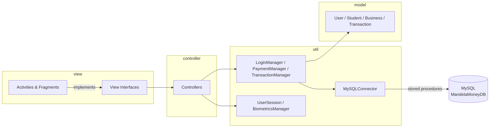

<div align="center">


[](https://git.io/typing-svg)

[](#)
[](#)
[](#)
[](#)
[](#)
[](#)
[](#)
[](#)
[](https://github.com/DanielJacksonAvo/MandelaMoney)

</div>

<div align="center">
  
</div>

## What is MandelaMoney

MandelaMoney is a native Android wallet built for a university campus, where students and local businesses can hold a balance, pay each other by scanning a QR code, request payments, deposit or withdraw funds, and keep track of every transaction, all secured behind biometrics and an encrypted local session.

Two account types share one wallet experience:

| 🎓 Student | 🏪 Business |
|---|---|
| Signs up with a student number | Signs up with a VAT number and phone number |
| Pays for campus goods and services | Receives payments and requests funds via QR |
| Tracks spending in one place | Manages incoming transactions in one place |

<div align="center">
  
</div>

## 🏆 Awards & Recognition

<div align="center">


</div>

On 30 October 2025, at the Nelson Mandela University Computer Science Expo, Team ByteMe (Daniel Jackson and Charlize Fourie) showcased MandelaMoney as their final year project, a mobile-first QR code financial transaction system built for the Nelson Mandela University micro-economy that eliminates transaction costs for students and businesses.

The project achieved a final mark of 97% and brought home three industry awards on the night:

- 🥇 **Wirk**, Best Project
- 🥇 **impact.com**, Best Project
- 🥈 **Avochoc**, 2nd Place Best Project

> Thank you to our supervisor, Janine Nel, and the Computer Science Department, for the support, the opportunity, and everything put in to make this happen. And to Charlize, thank you for being an absolute rockstar of a team member. None of this would have happened without our teamwork.

<div align="center">
  
</div>

## Table of Contents

- [Awards & Recognition](#-awards--recognition)
- [Features](#features)
- [Architecture](#architecture)
- [Tech Stack](#tech-stack)
- [Project Layout](#project-layout)
- [Getting Started](#getting-started)
- [Phone & Tablet UI](#phone--tablet-ui)
- [Security](#security)
- [Testing](#testing)
- [Mandela Money in Motion](#-mandela-money-in-motion)

## Features

<table>
<tr>
<td width="50%" valign="top">

**💸 Payments**
- Scan a QR code to pay another user instantly
- Generate a QR code to request payment
- Deposit funds from a linked bank card
- Withdraw funds to a bank account
- Confirmation and success/failure screens for every flow

**📊 Transactions**
- Full transaction history per user
- Filter by period (today, last week, last month, last year)
- Filter by type (incoming, outgoing, deposit, withdrawal)
- Search across past transactions

</td>
<td width="50%" valign="top">

**🔐 Security & Access**
- Biometric app unlock (fingerprint, face, or device credential)
- Encrypted on-device session storage
- SHA-256 password hashing
- Email based account recovery with a one-time code
- Change password and edit profile in-app

**👤 Accounts**
- Student and business sign-up flows with field validation
- Editable profiles for both account types
- Live balance display on the dashboard
- Phone and tablet optimised layouts

</td>
</tr>
</table>

## Architecture

MandelaMoney follows a layered MVC style split into `model`, `view` (activities, fragments, and view interfaces), `controller`, and `util`, so every screen talks to the database through a small, testable contract instead of directly.



Every write path (login, deposit, withdraw, payment, password reset) calls a MySQL **stored procedure** through a `CallableStatement`, so business rules like sufficient-funds checks live next to the data, not scattered across the app.

## Tech Stack

<div align="center">


</div>

| Layer | Choices |
|---|---|
| UI | AppCompat, Material Components, ConstraintLayout, BlurView |
| Camera & QR | CameraX + ZXing Android Embedded |
| Auth | AndroidX Biometric, EncryptedSharedPreferences |
| Data | MySQL Connector/J 5.1.49, stored procedures |
| Hosting | MySQL database containerised with Docker, running on an Ubuntu server |
| Email | JavaMail (Gmail SMTP) for recovery codes |
| Testing | JUnit 4, AndroidX Test, Espresso |
| Version Control | Git, hosted on GitHub |

## Project Layout

```
app/src/main/java/com/example/mandelamoney/
├── controller/     # One controller per screen, orchestrates view + util calls
├── model/          # User, Student, Business, Transaction
├── view/
│   ├── Iface/      # View contracts implemented by activities/fragments
│   ├── activity/   # Screens: login, dashboard, payments, deposits, profile...
│   └── fragment/   # Dashboard tabs: home, profile, settings, transaction history
├── adapter/        # RecyclerView adapters (transactions, popup menus)
└── util/           # MySQLConnector, PaymentManager, TransactionManager,
                     # LoginManager, BiometricsManager, UserSession, Hasher...
```

## Getting Started

**Prerequisites**
- Android Studio (Ladybird or newer) with SDK 35 installed
- A MySQL server running the `MandelaMoneyDB` schema and stored procedures
- A Gmail account for sending recovery emails (or your own SMTP setup)

**1. Clone the project**

```bash
git clone https://github.com/DanielJacksonAvo/MandelaMoney.git
cd MandelaMoney
```

**2. Point the app at your database and mailbox**

Credentials are wired through `BuildConfig` fields in [app/build.gradle.kts](app/build.gradle.kts). Replace the placeholders with your own values (or, better, load them from a local, git-ignored `local.properties` file rather than committing real secrets):

```kotlin
buildConfigField("String", "DB_USERNAME", "\"your_db_user\"")
buildConfigField("String", "DB_PASSWORD", "\"your_db_password\"")
buildConfigField("String", "DB_URL", "\"jdbc:mysql://<host>:3306/MandelaMoneyDB?useSSL=true\"")
buildConfigField("String", "EMAIL_USERNAME", "\"your_sender@gmail.com\"")
buildConfigField("String", "EMAIL_PASSWORD", "\"your_app_password\"")
```

**3. Run it**

```bash
./gradlew :app:installPhoneDebug
```

or open the project in Android Studio, pick the `phone` (or `tablet`) build variant, and hit Run.

## Phone & Tablet UI

MandelaMoney is not just a stretched phone screen on a bigger display, it ships two genuinely distinct interfaces from one codebase, built with separate manifests, layouts, and even fragment sets per form factor.

| | 📱 Phone | 📲 Tablet (landscape) |
|---|---|---|
| **Flavor** | `phone` (`.phone` suffix) | `tablet` (`.tablet` suffix) |
| **Layout source** | `res/layout/` | `res/layout-sw600dp-land/` |
| **Dashboard** | Single pane, one screen at a time | **Dual pane**, a second `dashboardFrameExtra` host runs alongside the main content |
| **Profile & Settings** | One fragment per tab | Primary fragment **plus** a companion (`SecondProfileHomeDashboardFragment`, `SecondSettingsDashboardFragment`) shown side by side |
| **Navigation feel** | Deep, tap-through | Wider, more at-a-glance, fewer taps to compare info |

`DashboardActivity` checks `R.bool.is_tablet_landscape` at runtime and, when true, feeds a second fragment straight into that extra pane, turning what is a single stacked screen on a phone into a true master-detail layout on a tablet, no separate app, one shared controller and data layer underneath.

```bash
./gradlew :app:installPhoneDebug    # single-pane phone UI
./gradlew :app:installTabletDebug   # dual-pane tablet UI
```

## Security

- **Encrypted session storage.** `UserSession` persists the logged-in user through `EncryptedSharedPreferences` backed by an AES-256-GCM master key, not plain text prefs.
- **Biometric gate.** `BiometricsManager` locks the app behind fingerprint, face, or device credential, falling back gracefully when the device supports neither strong nor weak authentication.
- **Hashed passwords.** `Hasher` SHA-256 hashes passwords client side before they ever reach the database.
- **Parameterised data access.** All queries go through `CallableStatement` bound stored procedures, never string-built SQL.
- **TLS to the database.** The JDBC URL is configured with `useSSL=true` for the connection to MandelaMoneyDB.

## Testing

```bash
./gradlew testPhoneDebugUnitTest        # JUnit unit tests
./gradlew connectedPhoneDebugAndroidTest # Espresso instrumented tests
```

## 📊 Mandela Money in Motion

Some fun numbers from Team ByteMe (Charlize Fourie & Daniel Jackson) building MandelaMoney.

<table>
<tr>
<td width="50%" valign="top">

**By The Numbers**
| | |
|---|---|
| 👩‍💻👨‍💻 Lines of Code | +32,499 |
| 📈 Commits over 64 Branches | 629 |
| ☕ Minimum Cups of Coffee | 316 |
| 🕺 Hidden Rick Rolls | 24 |
| 🖥 Hours Spent Coding | 269h |
| 😴 Hours of Sleep Lost | 374h 51m |

</td>
<td width="50%" valign="top">

**Total Effort**
| | |
|---|---|
| 📽 Animated Video Iterations | 16 |
| 📝 Poster Iterations | 29 |
| 📑 Pages of Project Docs | 249 |
| 📐 CAD Design Iterations | 79 |
| 🖨 Test 3D Prints | 9 |

</td>
</tr>
</table>

**Final Result**
- 📽 1x marketing artefact, with pretty cool animations (and a little trauma)
- 📝 6x posters
- 📑 95% average for project docs (proposal and FSD, as of writing)
- ☕ 25x 3D printed MandelaMoney coasters
- 📱 1x awesome app

<sub>Thank you to StreamGroup for sponsoring the coffee that day.</sub>

## Authors

<div align="center">

| [<br>Daniel Jackson](https://github.com/DanielJacksonAvo) | [<br>Charlize Fourie](https://github.com/Charlie-Fourie) |
|:---:|:---:|

</div>

<div align="center">
  <br/>
  
  <sub>Built with 💛 for the Nelson Mandela University community, South Africa 🇿🇦</sub>
</div>
